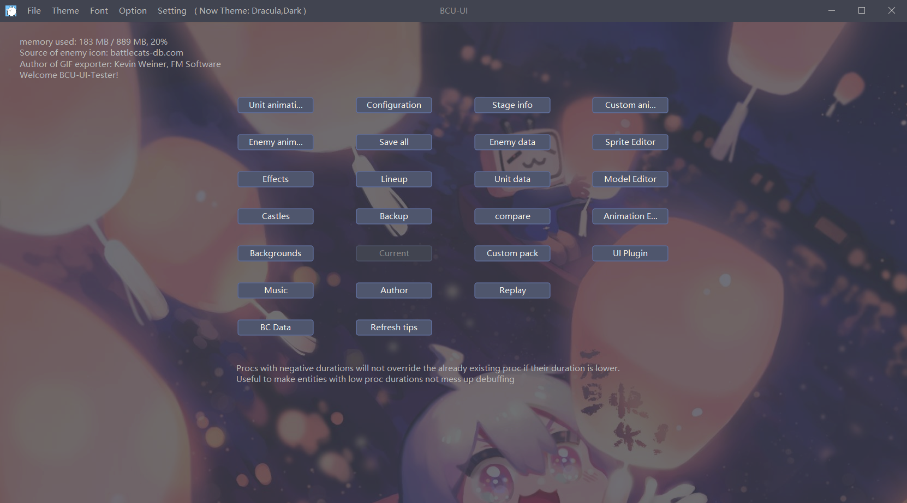
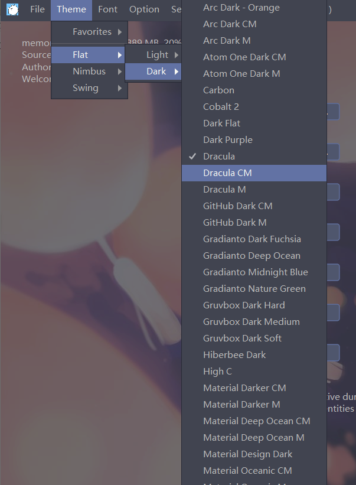
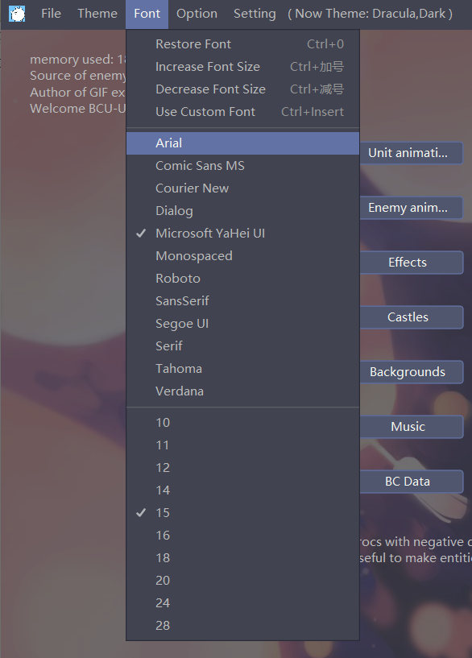

# UI-Plugin

A UI-Plugin For BCU, which can beautify BCU Frame look and feel with theme, font, and background image.




## About Theme Feature

*   Use third-party Swing Theme: Flat (https://github.com/JFormDesigner/FlatLaf)




## About Font Feature

*   Reference: flatlaf-demo




## About This Repository 

*   This repository is to save my temporary code.
*   I'll consider to Pull Request to BCU repo when the time was appropriate.


## For Dev

*   If you want to test UI-Plugin code:

    *   clone BCU origin repo: BCU-java-PC (https://github.com/battlecatsultimate/BCU-java-PC)
    *   replace origin code with this repository code (src directory).
    *   delete file: ./src/main/java/page/MenuBarHandler.java

    

*   below are the details what I modified code and reason

    *   main method of `MainBCU.java`: to enable UI-Plugin

        ```java
        public static void main(String[] args) {
            Thread.setDefaultUncaughtExceptionHandler(MainBCU::noticeErr);
            trueRun = true;
            UserProfile.profile();
            CommonStatic.ctx = new AdminContext();
            CommonStatic.def = new UtilPC.PCItr();
        
            BCUWriter.logPrepare();
            BCUWriter.logSetup();
            BCUReader.readInfo();
        
            ImageBuilder.builder = builder = USE_JOGL ? new GLIB() : FIBI.builder;
            BBBuilder.def = USE_JOGL ? new GLBBB() : AWTBBB.INS;
        
            // get Plugin instance
            Plugin P = UIPlugin.getInstance();
        
            // UIPlugin has work to do before MainFrame init 
            P.doBeforeFrameInit();
            new MainFrame(Data.revVer(MainBCU.ver)).initialize();
            // do after frame init
            P.doAfterFrameInit();
        
            // MainFrame should be invisible before calling method 
            MainFrame.F.setVisible(true);
            new Timer().start();
        
            if (!announce0510 && checkOldFileExisting()) {
                Opts.popAgreement("Before migrating v5", "<html><p style=\"width:500px\">This BCU version has completely different code structure from previous version (0-4-10-9), so others data will get reformatted. This process cannot be undone, and it may cause error while reformatting. We recommend you to backup your files (user/replays/res folder) before migrating v5. Agree on this text to continue.</p></html>");
            } else {
                announce0510 = true;
            }
            
        	// check Plugin update 
            P.checkUpdate();
            BCJSON.check();
            CommonStatic.ctx.initProfile();
        
            BCUReader.getData$1();
            // Plugin may do sth
            P.doAfterReadingLang();
            BattleBox.StageNamePainter.read();
        
            loaded = true;
            afterLoading();
            // Plugin may do sth
            P.doAfterLoading();
        }
        
        private static void afterLoading() {
            // this MenuBarHandler is not page.MenuBarHandler but plugin.ui.main.util.MenuBarHandler
            MenuBarHandler.enableSave();
            MainFrame.changePanel(new MainPage());
        }
        ```

        

    *   `MainPage.java`: to add a UIPage

        *   this modification is unnecessary because I havn't finish UIPage

    *   `Page.java`: to enable custom BG

        ```java
        public abstract class Page extends JPanel implements RetFunc {
        	...
                
        	// don't need this no more
        //	public static Color BGCOLOR = MainBCU.light || !MainBCU.nimbus ? new Color(255, 255, 255) : new Color(54, 54, 54);
        
            // paint BG or Gif by UIPlugin
        	@Override
        	protected void paintComponent(Graphics g) {
        		super.paintComponent(g);
        		UIPlugin.paintPage(g, this);
        	}
            
        	// removed some code for this method because `BGCOLOR` is deprecated
        	public final Page getFront() {
        		return front;
        	}
            
            ...
        }
        
        ```

    *   ​	and so on ...


## For User Who Wanna Try BCU-UI In Advance

*   well, now BCU-UI can run successfully with features above, but its core version is 05112 and I also have some ideas to improve it. so, wait for it.


